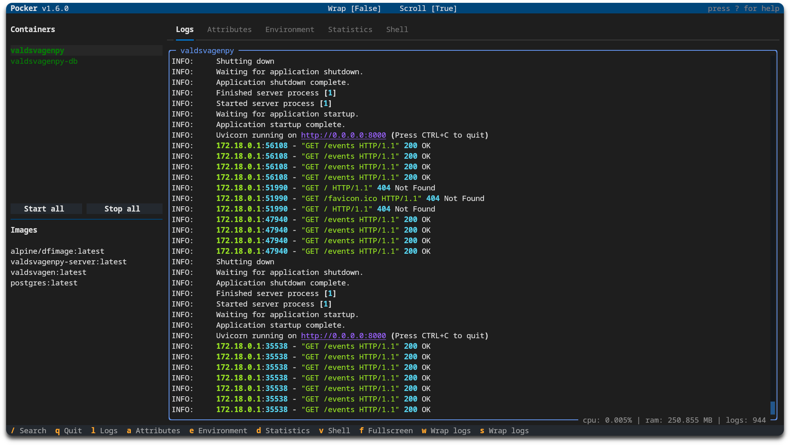
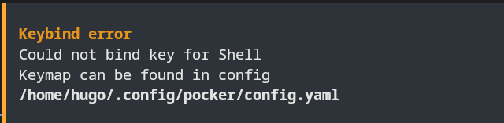

<p align="center">
  
  
</p>

# 👋🏼 Introduction

Pocker is a TUI tool to help with docker related tasks. For example,

- View containers/images.
- See logs and attributes.
- Manage status of containers.

The tool is heavily based on [docker-py](https://docker-py.readthedocs.io/en/stable/index.html) and [textual](https://github.com/textualize/textual/).  
A big thanks goes over to the creator and contributors of textual as it makes for a very sleek and easy interface.

[](https://buymeacoffee.com/pommee)

## 🤏🏼 Prerequisite

> [!NOTE]
> Pipx must be installed.

```shell
pip install pipx
```

## 📦 Installation

### Latest version

```shell
pipx install git+https://github.com/pommee/Pocker@main
```

### Install from local repository

```bash
git clone https://github.com/pommee/Pocker.git
cd Pocker
pipx install .
```

## 🚦 Usage

```shell
pocker          # Start pocker
pocker update   # Fetch and install latest version
```

Keybinds can be seen in the footer when started or by pressing `?` to display help modal.

## 🔧 Configuration

Upon the first startup, a configuration file will be generated and stored at `$HOME/.config/pocker/config.yaml`.

| Key              | Default | Info                                                                                                                                  |
| ---------------- | ------- | ------------------------------------------------------------------------------------------------------------------------------------- |
| log_tail         | 2000    | At **startup**, Pocker will fetch `log_tail` amount of container logs.<br> Not recommended to exceed ~3000 as startup will slow down. |
| max_log_lines    | 2000    | The displayed container logs are shown sequentially, with the oldest log being removed as a new one appears.                          |
| start_fullscreen | False   | Display container logs in fullscreen mode at startup.                                                                                 |
| start_scroll     | True    | Automatically scrolls when new logs are fetched.                                                                                      |
| start_wrap       | False   | When enabled, logs will wrap to fit the content window.                                                                               |

### Keymap [default]

| Key | Action        | Description                                                     |
| --- | ------------- | --------------------------------------------------------------- |
| `q` | Quit          | Exits the application.                                          |
| `l` | Logs          | Opens the logs view to display log entries.                     |
| `a` | Attributes    | Displays the attributes panel, showing various item attributes. |
| `e` | Environment   | Opens the environment settings view.                            |
| `d` | Statistics    | Shows statistical information related to the container.         |
| `v` | Shell         | Creates a shell for the current container.                      |
| `f` | Fullscreen    | Toggles fullscreen mode for the logs view.                      |
| `w` | Wrap Logs     | Toggles log wrapping in the logs view.                          |
| `s` | Toggle Scroll | Toggles scrolling mode for the current view.                    |

This table helps you understand the functionalities assigned to each key, making navigation and operation more efficient.

### Errors

Errors will be displayed whenever encountered.



> Example of faulty keybind for `Shell`; in this case the key does not exist in the config.
